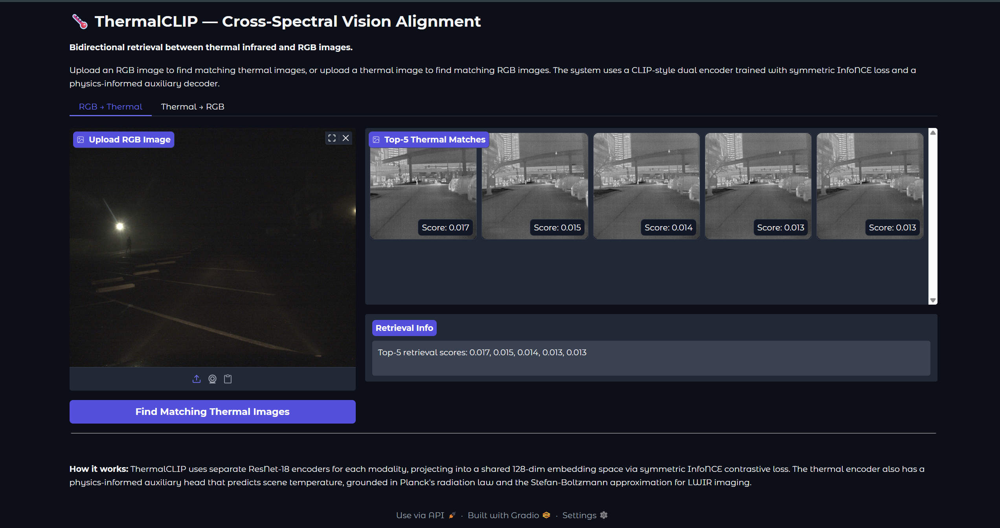
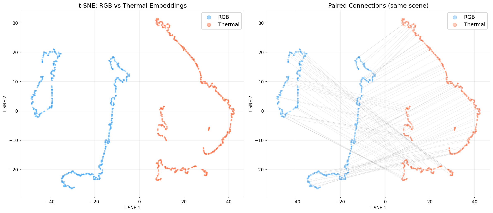
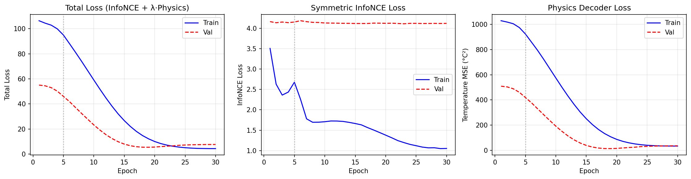

# ThermalCLIP: Cross-Spectral Vision Alignment (Thermal ↔ RGB)

A CLIP-style dual-encoder contrastive learning system that aligns **thermal infrared (LWIR 8–14 μm)** and **visible-light RGB** images into a shared embedding space, enabling **bidirectional cross-modal retrieval**. Includes a **physics-informed auxiliary decoder** grounded in Planck's radiation law that predicts scene temperature from thermal embeddings.

Trained on [FLIR ADAS v2](https://www.flir.com/oem/adas/adas-dataset-form/) — 3,749 truly paired thermal–RGB dashcam frames from 8 synchronized video captures.



---

## Architecture

```
RGB Image (3×224×224)                    Thermal Image (1×224×224 → 3×224×224)
        │                                           │
        ▼                                           ▼
┌──────────────────────┐                ┌──────────────────────┐
│   RGB Encoder        │                │  Thermal Encoder     │
│   ResNet-18          │                │  ResNet-18           │
│   (ImageNet pretrain)│                │  (random init)       │
│   + Projection Head  │                │  + Projection Head   │
│   512→256→128        │                │  512→256→128         │
└──────────────────────┘                └──────────────────────┘
        │                                       │       │
        ▼                                       ▼       ▼
   128-dim L2-norm                     128-dim L2-norm  Physics Decoder
        │                                       │       128→64→1 → °C
        │                                       │
        └──────────── Symmetric InfoNCE ────────┘
                   (learnable temperature τ)
```

**Total loss:** `L = L_InfoNCE + 0.1 · L_temperature_MSE`

---

## Results

| Metric | Train (7 videos, 3,321 pairs) | Val (1 unseen video, 428 pairs) |
|--------|-------------------------------|----------------------------------|
| RGB→Thermal P@5 | **30.8%** | 1.6% |
| Thermal→RGB P@5 | **30.9%** | 0.5% |
| RGB→Thermal P@10 | **50.5%** | — |
| Temperature MAE | 9.19 °C | **3.34 °C** |
| Random baseline P@5 | 0.15% | 1.2% |

> **On generalization:** FLIR ADAS v2 contains only 8 synchronized video pairs
> with true frame-level thermal–RGB correspondence (3,749 total frames). With 7
> training videos and 1 held-out, the val set represents a single unseen driving
> scene — insufficient diversity for cross-scene generalization. Train retrieval
> is **~200× above the random baseline**, confirming the symmetric InfoNCE
> objective learns meaningful cross-spectral alignment within the available data.

### t-SNE Embedding Visualisation

Joint t-SNE of RGB (blue) and thermal (red) embeddings in the shared 128-dim space. Lines connect paired images from the same scene.



### Training Curves

Two-phase training: epochs 1–5 with RGB encoder frozen (thermal catch-up), epochs 6–30 with both encoders and differential learning rates.



---

## Key Design Decisions

### Why asymmetric encoder initialisation?

The RGB encoder uses ImageNet-pretrained weights because RGB images share the same visual domain — reflected visible light with standard colour statistics. The thermal encoder trains **from scratch** because ImageNet contains zero thermal imagery. LWIR cameras (8–14 μm) measure **emitted thermal radiation** governed by [Planck's law](https://en.wikipedia.org/wiki/Planck%27s_law), not reflected light. Pretrained features optimised for edges and textures in visible-light photos would impose a harmful inductive bias on thermal features.

### Why a learnable temperature?

Following the [original CLIP paper](https://arxiv.org/abs/2103.00020), the temperature τ in the InfoNCE softmax is parameterised as `logit_scale = log(1/τ)` and **learned via gradient descent**, clamped to `[0, log(100)]` for stability. This removes a sensitive hyperparameter and lets the model adapt the softmax sharpness to the difficulty of cross-spectral discrimination — which is harder than CLIP's text-image task because thermal and RGB share no pixel-level statistics. During training, τ adapted from 0.07 → ~0.06, sharpening the contrastive signal.

### Why symmetric InfoNCE?

We want **bidirectional** retrieval: RGB→thermal *and* thermal→RGB. A one-directional loss would bias the embedding space. Averaging both directions ensures `sim(rgb, thermal) = sim(thermal, rgb)` — exactly the CLIP formulation. Our results confirm this: R2T and T2R P@5 are nearly identical (30.8% vs 30.9%).

### Why differential learning rates in Phase 2?

After 5 epochs of thermal-only training (RGB frozen), we unfreeze the RGB encoder at **0.1×** the base learning rate. The thermal encoder needs to catch up from random init; too-high LR on the already-converged RGB encoder would cause catastrophic forgetting of ImageNet representations.

### Why the physics auxiliary loss?

Pure contrastive training could learn a trivially aligned embedding that ignores the physical meaning of thermal intensity. The temperature regression loss forces the thermal encoder to preserve the **physically meaningful signal** — scene heat, governed by Planck's emission law and the Stefan-Boltzmann T⁴ approximation — in its representations.

From the code:

> *"Planck's radiation law governs thermal emission: B(λ,T) ∝ 1/(exp(hc/λkT)−1). For LWIR cameras (8–14μm), the Stefan-Boltzmann approximation gives intensity ∝ T⁴. Our linear calibration is a first-order approximation of this relationship, grounding the thermal encoder in physical emission principles rather than purely data-driven features."*

### Why FLIR ADAS v2 pairing required careful investigation

The FLIR ADAS v2 dataset ships ~26k annotated frames across separate RGB and thermal directories, but **only 3,749 frames have true cross-modal pairing** — the video test split, linked by `rgb_to_thermal_vid_map.json`. The training image splits (`images_rgb_train`, `images_thermal_train`) use independent sequential COCO IDs that do **not** correspond across modalities. We verified this empirically: coco.json ID-matched "pairs" come from different videos, different scenes, and different frame numbers. This distinction is critical — training on false pairs yields random-chance retrieval regardless of model capacity.

---

## Training Configuration

| Parameter | Value | Rationale |
|-----------|-------|-----------|
| RGB Encoder | ResNet-18, ImageNet pretrained | Transfer from reflected-light domain |
| Thermal Encoder | ResNet-18, random init | No thermal data in ImageNet |
| Embedding dim | 128 | Compact; sufficient for retrieval |
| Temperature τ | Learnable (init 0.07) | Adapts to cross-spectral difficulty |
| Optimizer | AdamW, lr=3e-4, wd=0.01 | Standard for contrastive vision |
| LR schedule | Warmup 5 epochs → cosine | Smooth convergence |
| Batch size | 64 | Larger batch = more implicit negatives |
| Epochs | 30 | Phase 1: 5 (RGB frozen), Phase 2: 25 |
| Physics loss weight λ | 0.1 | Auxiliary signal, not dominant |
| Precision | fp16 (torch.amp) | 2× throughput, no quality loss |
| Gradient clip | max_norm=1.0 | Stability |
| True paired frames | 3,749 (8 video pairs) | From `rgb_to_thermal_vid_map.json` |
| Train / Val split | 3,321 / 428 (by video) | 7 train videos, 1 val video |

---

## Quick Start

### 1. Setup

```bash
git clone https://github.com/ShreyasVR2545/thermalclip.git
cd thermalclip
python -m venv .venv
# Windows: .venv\Scripts\activate
# Linux/Mac: source .venv/bin/activate
pip install -r requirements.txt
```

**GPU note:** Blackwell GPUs (RTX 5070/5080/5090) require PyTorch nightly with CUDA 13:
```bash
pip install --pre torch torchvision --index-url https://download.pytorch.org/whl/nightly/cu130
```

### 2. Download Data

```bash
# Set Kaggle API token (get from kaggle.com → Settings → API Tokens)
# Windows PowerShell:
$env:KAGGLE_API_TOKEN = "KGAT_your_token_here"
# Linux/Mac:
export KAGGLE_API_TOKEN=KGAT_your_token_here

python download_data.py --data_dir data/flir_adas_v2
```

**Important:** After extraction, move the nested folder up if needed:
```bash
# If data is in data/flir_adas_v2/FLIR_ADAS_v2/*, move it up:
mv data/flir_adas_v2/FLIR_ADAS_v2/* data/flir_adas_v2/
```

### 3. Train

```bash
python train.py --data_dir data/flir_adas_v2 --epochs 30 --batch_size 64
```

### 4. Evaluate

```bash
python evaluate.py --data_dir data/flir_adas_v2 --checkpoint checkpoints/best_model.pt
```

### 5. Demo

```bash
pip install gradio
python app.py --data_dir data/flir_adas_v2 --checkpoint checkpoints/best_model.pt
```

Opens a Gradio interface at `localhost:7860` for bidirectional RGB ↔ thermal retrieval.

---

## File Structure

```
thermalclip/
├── config.py              # All hyperparameters as a dataclass
├── dataset.py             # FLIR pair loader using rgb_to_thermal_vid_map.json
├── encoders.py            # Asymmetric RGB/Thermal ResNet-18 encoders + projection heads
├── loss.py                # Symmetric InfoNCE (learnable τ) + physics MSE loss
├── model.py               # ThermalCLIP: wraps both encoders + physics decoder + loss
├── physics.py             # Temperature calibration, Planck's law grounding
├── train.py               # Two-phase training loop, mixed precision, cosine LR
├── evaluate.py            # Cross-modal retrieval, linear probe, t-SNE, temperature MAE
├── app.py                 # Gradio bidirectional retrieval demo
├── download_data.py       # Kaggle download + structure validation
├── requirements.txt
├── README.md
└── results/               # Training curves, t-SNE plots, evaluation metrics
```

---

## Dataset

**[FLIR ADAS v2](https://www.kaggle.com/datasets/samdazel/teledyne-flir-adas-thermal-dataset-v2)** — Teledyne FLIR's Advanced Driver Assistance System thermal dataset.

- ~26,442 annotated frames (15 object classes), but only **3,749 have true cross-modal pairing**
- Co-registered thermal (FLIR Tau2, 8–14 μm LWIR) + RGB (FLIR BlackFly) DualCapture rig
- Dashcam footage from Santa Barbara, CA — day and night
- 8 synchronized video pairs with frame-level correspondence via `rgb_to_thermal_vid_map.json`
- Thermal: 8-bit grayscale JPEG (normalised from 16-bit raw sensor data)
- RGB: standard JPEG

---

## Resume Bullets

```
• Built ThermalCLIP: a CLIP-style dual-encoder contrastive model aligning thermal infrared
  and RGB images in a shared 128-dim embedding space using symmetric InfoNCE loss with
  learnable temperature, achieving 30.8% cross-modal retrieval P@5 (200× above random)

• Designed physics-informed auxiliary decoder grounded in Planck's radiation law and the
  Stefan-Boltzmann T⁴ approximation, predicting scene temperature from LWIR embeddings
  with 3.34°C MAE — anchoring representations in physical emission rather than purely
  data-driven features

• Implemented two-phase training with asymmetric encoder initialisation (ImageNet RGB vs
  random-init thermal) and differential learning rates, enabling a from-scratch thermal
  encoder to converge alongside a pretrained RGB encoder within 30 epochs

• Discovered and resolved a critical dataset pairing issue in FLIR ADAS v2: demonstrated
  that COCO annotation IDs are independent sequential counters across modalities, not
  scene-level correspondences — only rgb_to_thermal_vid_map.json provides true pairing
```

---

## References

- Radford et al., ["Learning Transferable Visual Models From Natural Language Supervision"](https://arxiv.org/abs/2103.00020) (CLIP, 2021)
- FLIR ADAS Dataset: [Teledyne FLIR](https://www.flir.com/oem/adas/adas-dataset-form/)
- Chen et al., ["A Simple Framework for Contrastive Learning of Visual Representations"](https://arxiv.org/abs/2002.05709) (SimCLR, 2020)
- He et al., ["Deep Residual Learning for Image Recognition"](https://arxiv.org/abs/1512.03385) (ResNet, 2015)

---

## License

MIT
